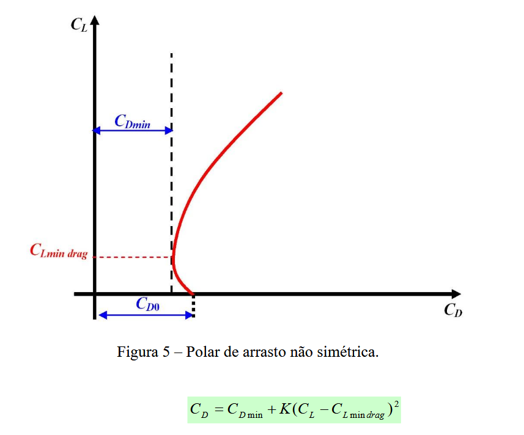

# polar_de_arrasto
Método Analítico para o Traçado da Polar de Arrasto de Aeronaves Leves Subsônicas

Este projeto tem como finalidade implementar, em Python, um modelo analítico para a determinação da curva polar de arrasto de aeronaves leves operando em regime subsônico para competições como a SAE-AeroDesign.

A ferramenta computacional desenvolvida possibilita a geração direta da curva polar, a partir de parâmetros geométricos e aerodinâmicos da aeronave, oferecendo ao projetista uma visualização clara da relação entre sustentação e arrasto. 

Tais informações são essenciais para a análise de desempenho e para a otimização do projeto preliminar de aeronaves.

Além de facilitar as iterações e refinamentos necessários durante as fases iniciais do desenvolvimento aeronáutico, o programa também reproduz, com precisão, os métodos utilizados na indústria para a construção da polar de arrasto. 

O código pode ser facilmente adaptado para diferentes configurações de aeronaves leves.

exemplo:
- input 0.045 p/ cd0 
- 0.05194 p/ k

You can reach me at rmilhomem[at]gmail[dot]com or connect on [LinkedIn](https://www.linkedin.com/in/rodolfo-space-force/) for collaborations.

## Licença

Este projeto está licenciado sob a Licença MIT. Você pode usar, modificar e redistribuir este código livremente, desde que mencione o autor original.

[Clique aqui para ver a licença completa.](https://opensource.org/licenses/MIT)
